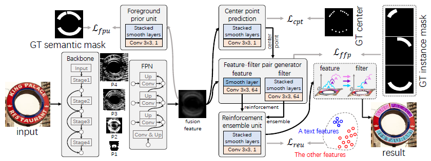
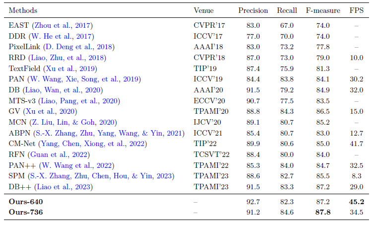
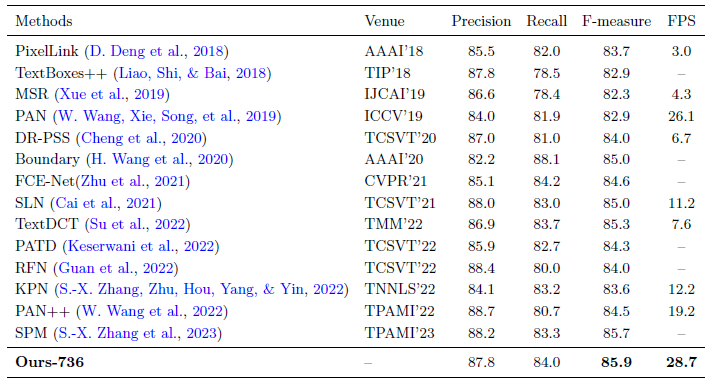
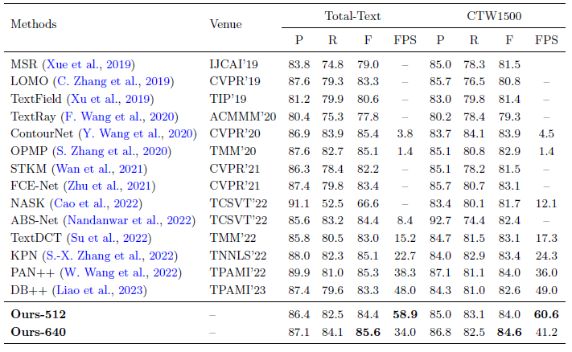
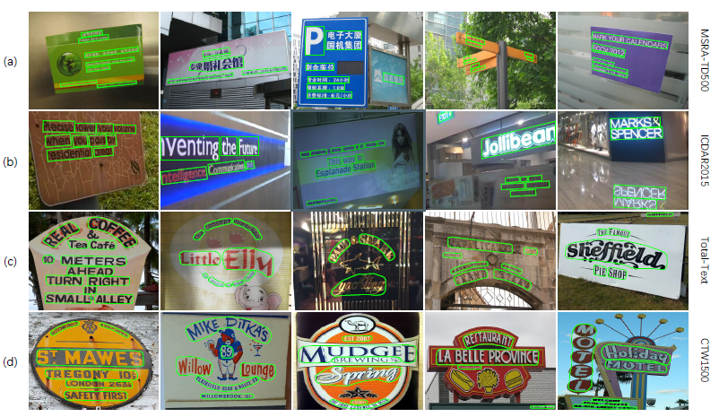

# Text-Pass-filter




## News
- The code for TPF is released.(2023.6.29)

## Installation
#### Set up the python environment
```
conda create -n tpf python=3.6.8
conda activate tpf

# install pytorch, the cuda version is 10.2
# You can also install other versions of cuda and pytorch, but please make sure # that the pytorch cuda is consistent with the system cuda

conda install pytorch==1.9.0 torchvision==0.10.0 torchaudio==0.9.0 cudatoolkit=10.2 -c pytorch

pip install cython pycocotools shapely Polygon3 imagecorruptions mmcv==1.5.0
```

#### Compile cuda extensions
```
cd tools/Connected_components_mhz
python3 setup.py install

cd ../solotext_util
python3 setup.py install

cd ..
```


## Training
#### Training on MSRA-TD500
```
#just run
python train.py
```
#### Training on Total-Text
```
#first replace "from config import r18_msra" with "from config import r18_tt"
#then 
python train.py
```
#### Training on CTW1500
```
#first replace "from config import r18_msra" with "from config import r18_ctw"
#then 
python train.py
```
#### Training on ICDAR2015
```
#first replace "from config import r18_msra" with "from config import r18_ic15"
#then 
python train.py
```

##Performance
####On MSRA-TD500

####On ICDAR2015

####On Arbitrary-Shaped-Text Datasets


##Visualization



## Contributing to the project
Any pull requests or issues are welcome.

## License

For academic use, this project is licensed under the 2-clause BSD License - see the LICENSE file for details. For commercial use, please contact the authors. 